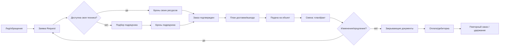

# Специализированная CRM для Katet.tech в аренде спецтехники

## Executive summary

**Подтверждённые факты о Katet (публичный контекст)**  
Компания работает круглосуточно, принимает заявки через телефон и мессенджеры (Telegram/WhatsApp), обещает ответ “в течение ~15 минут” и подчёркивает скорость/оперативность подачи техники. citeturn1view0turn1view3  
География: Москва и Московская область, при этом подача внутри МКАД бесплатна; стандартный срок доставки заявлен “от 2 до 6 часов”, возможна срочная доставка “в день обращения”. citeturn2view0turn1view3  
Платёжные условия: для разовых заказов — 100% предоплата; при длительной аренде/крупных заказах возможна частичная предоплата “от 30%” и график/оплата по факту; для постоянных клиентов — отсрочка. citeturn2view0  
У Katet набор предложений шире “голой аренды”: помимо аренды/услуг техники есть перевозки (в т.ч. негабарит, перевозка спецтехники, нерудные материалы, перевозки по России), вывоз (мусор/грунт/снег), демонтаж, земляные работы. citeturn1view0turn1view3turn2view2  
Каталог/листинги показывают **единицу расчёта “смена”** (цены “р./смена”), **наличие (“в наличии”)**, **атрибуты техники** (грузоподъёмность/объём/габариты) и **быструю подачу (“доставка от 60 минут”)** как маркетинговое обещание по некоторым позициям. citeturn2view2  
Юр.карточка: юридическое лицо — entity["company","ООО «КАТЕТ»","equipment rental, moscow"]; указан ОКВЭД 49.41 (грузовой автотранспорт), что косвенно подтверждает сильную роль логистики/перевозок в бизнес-модели. citeturn2view1  
Также публично заявлены: скидка “-20% при заказе от 2-х смен”, “допуск Ростехнадзора”, возможность работ в пределах ТТК/Садового кольца (как сигнал про пропуска/ограничения движения и требования к документам/допускам). citeturn1view1

**Ключевая мысль исследования (аналитический вывод)**  
Для Katet “CRM” должна быть не про лиды и воронку продаж, а про **сквозной контур “заявка → бронь → заказ → выезд/доставка → смена/факт работ → закрывающие документы → оплата/дебиторка”**. Продажи в этой нише не отделимы от операционного диспетчирования: скорость ответа, подбор техники, проверка доступности и логистика — это и есть “конверсия”.

**Главный архитектурный вывод (рекомендация)**  
Начинать нужно с **операционно-центричной доменной модели** (заказ/смена/единица техники/доставка/оператор/подрядчик/документы/оплаты), а CRM-функции (лиды, коммуникации, маркетинг) — как “слой” сверху. Попытка построить нишевую логику только на универсальной CRM (вроде Bitrix24) приводит к тяжёлой кастомизации и хрупким процессам, потому что универсальная CRM оперирует сущностью “сделка”, а аренда спецтехники — сущностями “ресурс во времени” и “факт смены”.

### 10–20 ключевых выводов (факты / выводы / гипотезы / рекомендации)

1) **Факт:** Katet обещает ответ ~15 минут и 24/7. citeturn1view0turn1view3  
   **Вывод:** KPI “скорость реакции + скорость подтверждения наличия/подачи” надо сделать системным (SLA, таймеры, автоэскалации).

2) **Факт:** Бесплатная подача в пределах МКАД, доставка 2–6 часов, срочная доставка в день обращения. citeturn2view0turn1view3  
   **Вывод:** логистика — конкурентное ядро; CRM должна включать диспетчеризацию (ETA, окна, контроль опозданий).

3) **Факт:** Разовые заказы — 100% предоплата; возможны частичная предоплата/отсрочка. citeturn2view0  
   **Вывод:** дебиторка/кредитные лимиты/стоп-листы — критический функционал MVP, иначе “утечка денег”.

4) **Факт:** Ценообразование и единица продажи часто “за смену”, есть скидки от 2 смен. citeturn2view2turn1view1  
   **Вывод:** нужен механизм тарифов и правил (минимальная смена, овертайм, скидки, надбавки, стоимость мобилизации).

5) **Факт:** Каталог показывает “в наличии” и характеристики единиц/моделей. citeturn2view2  
   **Вывод:** система должна предотвращать двойное бронирование и учитывать занятость “по времени” (календари ресурсов).

6) **Факт:** У Katet есть услуги перевозок/демонтажа/земляных работ, а не только аренда. citeturn1view0turn1view3turn2view2  
   **Вывод:** доменная модель должна поддерживать разные типы заказов: “аренда техники”, “работы под ключ”, “перевозка/рейсы”.

7) **Факт:** Katet заявляет “вся техника предоставляется с опытными операторами” и готовность к замене техники при поломке по их вине. citeturn2view0  
   **Вывод:** учёт операторов/смен/инцидентов — часть операционного контура, иначе нельзя управлять заменами и претензиями.

8) **Факт:** Указаны “допуск Ростехнадзора” и работы в ТТК/Садовом кольце. citeturn1view1  
   **Гипотеза:** требуется управление пропусками/ограничениями маршрутов, подтверждение допусков/документов на конкретные объекты.  
   **Рекомендация:** включить сущности “допуск/разрешение/пропуск” как атрибут заказа и техники.

9) **Факт (по заказчику):** компания работает в entity["company","Bitrix24","crm platform"].  
   **Вывод:** целевая система должна закрыть разрыв “продажи ↔ операции”; иначе Bitrix24 остаётся “фронтом”, а диспетчеризация живёт в WhatsApp/Excel.

10) **Факт:** Bitrix24 описывает “сделку” как объект, ведущий продажу от обращения до оплаты. citeturn0search9  
    **Вывод:** в аренде спецтехники “оплата” часто зависит от факта смен (доработки, продления, простои), значит “сделка” недостаточна как первичная сущность.

11) **Факт:** Bitrix24 поддерживает несколько воронок/пайплайнов и автоматизацию правилами/триггерами. citeturn0search1turn0search5turn0search21  
    **Вывод:** это помогает в продажах, но не заменяет ресурсное планирование/диспетчерскую доску.

12) **Факт:** Bitrix24 Smart Process Automation позволяет создавать кастомные сущности и автоматизировать сценарии. citeturn4search5turn4search28  
    **Вывод:** можно “натянуть” операционный контур на SPA, но при росте количества единиц техники и смен возникает сложность связей, прав и производительности (аналитический вывод; требуется проверка на пилоте).

13) **Факт:** В телематике Wialon описываются слои контроля: позиции, маршруты, задания/работы, водители/смены, отчёты. citeturn4search19  
    **Вывод:** интеграция телематики — не “nice-to-have”, а база для контроля подач/простоев/фактологии.

14) **Факт:** entity["company","Geotab","fleet telematics vendor"] предоставляет API/SDK и объектные модели для статуса устройства (локация, скорость, события). citeturn3search2turn3search9turn3search5  
    **Вывод:** даже на MVP можно начать с “минимального фида” (локация/статусы), а затем расширять до диагностики/исключений.

15) **Факт:** Крупные прокатчики (entity["company","United Rentals","equipment rental company"], entity["company","Sunbelt Rentals","equipment rental company"], entity["company","Herc Rentals","equipment rental company"]) развивают клиентские порталы “rent/track/extend/pay”, управление инвойсами/заказами/объектами и телематику как часть сервиса. citeturn5search0turn5search5turn5search6turn5search7  
    **Вывод:** нишевой стандарт UX — самообслуживание клиента по “активным арендам” и быстрые действия “продлить/закрыть/вызвать замену”.

16) **Рекомендация:** первичной сущностью будущей системы сделать **“Заказ на аренду/работы”**, а лид/сделку — “оболочкой” вокруг него для маркетинга/продаж. Это снижает разрыв между продажами и операциями и лучше соответствует реальным потерям денег (двойные брони, простои, неучтённые продления, дебиторка).

---

## Контекст Katet

### Структура услуг и признаки операционной модели

**Подтверждённые факты**  
На сайте Katet выделены два крупных блока:  
— “Аренда” (категории спецтехники: экскаваторы разных типов, манипуляторы (в т.ч. вездеходы/длинномеры), автовышки, автокраны, самосвалы, катки, компрессоры, илососы, тралы, подъёмники (коленчатые/ножничные/телескопические), поливомоечные машины, бульдозеры, экскаваторы‑погрузчики, мини‑погрузчики и др.). citeturn1view0turn1view3  
— “Услуги”: перевозки (негабарит тралом, перевозка спецтехники, перевозка нерудных материалов, грузоперевозки по России), вывоз (строительный мусор/грунт/снег), демонтаж и земляные работы (траншеи, котлованы и др.). citeturn1view0turn1view3turn2view2

**Аналитические выводы**  
1) Катет — это не только “прокат”, но и “подрядный сервис”, где часть выручки, вероятно, формируется как **услуга выполненных работ** (включая экипаж/оператора) и/или как “логистический сервис” (доставка, перевозки).  
2) Наличие направлений “перевозка нерудных материалов” и “перевозка спецтехники” усиливает роль диспетчеризации и маршрутизации — CRM должна хранить “объект‑адрес‑окно работ” как первичные атрибуты, а не как комментарий в сделке.

### Категории техники и единицы учёта

**Подтверждённые факты**  
На страницах услуг/категорий видны карточки позиций с ценой по “смене”, признаками наличия (“в наличии”), набором технических атрибутов (например, кузов/объём/грузоподъёмность у самосвалов) и CTA “быстрый заказ”. citeturn2view2

**Аналитические выводы**  
1) Даже если сайт отображает “позиции”, в операциях неизбежно придётся перейти от “модель/тип техники” к **учёту по единицам (Unit)**: иначе невозможно обещать “доставка за 60 минут” без риска двойного подтверждения.  
2) Цена “за смену” подразумевает: фиксированную минимальную длительность, правила сверхсмены и необходимость фиксировать **факт начала/окончания**.

### Каналы заявок, обещания клиенту, география

**Подтверждённые факты**  
Каналы связи включают телефон, email, Telegram и WhatsApp; на сайте есть форма “Оформление заказа” (обещание ответа ~15 минут). citeturn1view0turn1view3turn2view0  
Доставка: Москва и Московская область; внутри МКАД подача бесплатна; сроки “2–6 часов”, срочная доставка в день обращения; доставка за МКАД оплачивается в обе стороны; логист решает вопросы доставки/погрузки/разгрузки. citeturn2view0turn1view3  
Отдельно в навигации “Города” перечислены города МО и отдельное направление “Тверь и область”. citeturn1view1

**Аналитические выводы**  
1) География и “бесплатная подача в пределах МКАД” требуют расчёта зоны (условно “зона 0/зона 1/зона 2”), что удобно реализовать через **геозоны/правила**.  
2) Операционная модель явно предполагает роль “логист/диспетчер”, а также стандартизированный процесс подтверждения и постановки в график.

### Коммерческие условия, документы, оплата

**Подтверждённые факты**  
— Акции/условия: скидка -20% при заказе от 2 смен; скидки постоянным клиентам. citeturn1view1turn1view3  
— Оплата: наличный расчёт (физлица), безналичный (юрлица, с/без НДС), комплект документов (договор, акты, счета‑фактуры и пр.); 100% предоплата для разовых заказов; частичная предоплата от 30% при длительной аренде/крупных заказах; отсрочка для постоянных клиентов. citeturn2view0  
— В “реквизитах” указан банк entity["company","Банк Точка","russian bank"] и реквизиты компании. citeturn2view1

**Аналитические выводы**  
1) Коммерческая логика в аренде спецтехники — это не только “сумма сделки”, а **график оплат + факт работ + корректировки** (продления, простой, изменение объёма, доп. навеска/услуги).  
2) Закрывающие документы — обязательный “операционный выход” процесса; без правильной структуры сущностей документы начинают жить отдельно от факта смен, что бьёт по дебиторке.

---

## Карта рынка и болей

### Макро-контекст и почему нишевая “операционная CRM” становится обязательной

**Подтверждённые факты (рынок)**  
entity["organization","American Rental Association","rental industry association"] регулярно публикует прогнозы по рынку рентала; в публичных материалах/пересказах прогнозируются существенные объёмы рынка и рост (с оговорками о замедлении темпов). citeturn0search2turn0search10turn0search14turn0search6  
Крупные игроки инвестируют в цифровые инструменты и телематику как часть сервиса и повышения эффективности управления арендой. citeturn5search0turn5search16turn5search32

**Аналитический вывод**  
Когда рынок растёт и конкуренция усиливается, выигрывают те, кто быстрее подтверждает наличие/доставку и точнее управляет циклом аренды (минимизирует простои, дебиторку, потерю “неучтённых” смен). Это требует цифрового ядра, а не “наборов карточек” в CRM.

### Боли арендодателя (оператора парка) по цепочке процессов

Ниже — **типовые боли ниши аренды спецтехники**, с привязкой к процессам, которые вы перечислили. Там, где источник описывает только инструмент/возможность, я отмечаю это как подтверждение “паттерна”, а не статистику.

**Входящая заявка → квалификация**  
- Потеря заявок из-за многоканальности (телефон + мессенджеры + сайт) и отсутствия единого SLA. Публично Katet делает ставку на быстрый ответ; значит потеря времени — прямой риск для конверсии. citeturn1view0turn1view3  
- Ошибки в сборе минимальных параметров (адрес, тип работ, окно подачи, условия доступа, нужна ли навеска) — приводят к “ложному подтверждению”.

**Подбор техники → проверка доступности → резервирование**  
- Главная операционная боль — **“ресурс во времени”** (занятость экземпляра техники + оператор + трал/доставка). Именно поэтому в цифровых решениях рентала ключевой модуль — предотвращение двойного бронирования и конфликтов расписания (так это подаёт, например, рынок софта для рентала и прокатчики с порталами управления арендами). citeturn5search5turn5search0turn3search0turn3search4 *(заметка: источники Texada/Point of Rental — маркетинговые; использовать как продуктовый паттерн, а не доказательство экономического эффекта)*  
- Прайс “за смену” требует правил минимальной смены/переработки и прозрачной фиксации факта. Катет уже продаёт “смены” и скидки от 2 смен. citeturn2view2turn1view1

**Логистика и подача**  
- Срыв срока подачи (опоздание), неверный расчёт времени в пути, неоптимальные маршруты/окна. У Katet SLA по доставке (2–6 часов) и срочные подачи — это значит, что “календарь + ETA” должен быть встроен. citeturn2view0  
- Неучтённая стоимость мобилизации (доставка туда-обратно за МКАД) и вариативность (трал, перегон своим ходом). Katet явно описывает эти правила. citeturn2view0

**Работа с оператором/экипажем**  
- Несостыковка графика техники и машиниста; отсутствие сменных листов/таймшитов; конфликт по переработкам/ночным сменам. Katet заявляет предоставление техники с операторами и ответственность оператора на объекте. citeturn2view0  
- Проверка допусков/документов (особенно в зонах ограниченного движения/режима) — у Katet это отражено через “ТТК и Садовое кольцо” и “допуск Ростехнадзора”. citeturn1view1

**Подрядчики (субаренда)**  
- Потеря маржи и контроля: подрядчик подтвердил, но не приехал; приехал не тот класс техники; “счёт от подрядчика не бьётся с обещанием клиенту”; нет единого реестра надёжности.  
- Сложные документы и взаиморасчёты (две стороны договоров, акты, НДС/без НДС) — у Katet уже заявлено разделение условий оплаты (в т.ч. НДС/без НДС). citeturn2view0

**Расчёт стоимости, изменение заказа, продление**  
- Самая частая “утечка денег” — незафиксированные изменения (продлили ещё на день, добавили навеску, сдвинули окно, уехали на другой объект) → потом спор по актам.  
- Паттерн крупных прокатчиков — дать клиенту инструменты “extend/call off rent”, чтобы изменения фиксировались сразу. citeturn5search5turn5search7turn5search30

**Закрывающие документы, оплаты и дебиторка**  
- Узкое место — скорость обмена документами и прозрачность статусов “акт сформирован/подписан/отклонён”, особенно для юрлиц.  
- В РФ это почти всегда упирается в ЭДО; у entity["company","Контур.Диадок","edo platform"] есть API для интеграции юридически значимого документооборота. citeturn4search0turn4search14turn4search26  
- По дебиторке критичны: кредитные лимиты, отсрочки (у Katet это явно есть для постоянных клиентов), стоп‑отгрузка/стоп‑выезд при просрочке. citeturn2view0

**Повторные продажи**  
- Повторный заказ “по шаблону” (тот же объект/контакты/техника) — ключевой ускоритель. Крупные порталы прямо строят UX вокруг “управления активными арендами” и повторения. citeturn5search5turn5search0

**Претензии и инциденты**  
- Поломка/замена, простой по вине сторон, повреждения/штрафы — требуют отдельного контура (инцидент → расследование → решение → корректировка счёта/акта). Katet заявляет бесплатную замену при поломке по их вине (это юридически и операционно значимо). citeturn2view0

### Боли клиентов (заказчиков)

**Подтверждённые факты (паттерны сервисов рынка)**  
Клиентские порталы крупнейших компаний фокусируются на “rent/track/return/pay”, управлении арендой по объектам, инвойсам и уведомлениям, что явно коррелирует с болями клиентов: прозрачность статуса, сроков, документов и платежей. citeturn5search5turn5search0turn5search6turn5search7

**Аналитический вывод**  
Клиенту важнее всего: 1) быстро понять “приедет ли сегодня”, 2) не спорить по часам/сменам, 3) получить документы, 4) иметь простой способ продления/остановки аренды. Поэтому CRM должна уметь отдавать клиенту “витрину активных аренд” (даже если без полного e‑commerce на MVP).

---

## Анализ ограничений Bitrix24 для этой ниши

### Что Bitrix24 хорошо закрывает (факт)

**Подтверждённые факты по Bitrix24**  
Bitrix24 описывает “сделку” как CRM‑объект со стадиями, суммой, продуктами и историей коммуникаций, используемый для ведения продажи “от обращения до оплаты”. citeturn0search9  
Поддерживаются пайплайны (несколько воронок), разграничение доступов, kanban‑стадии. citeturn0search1  
Есть автоматизация правилами/триггерами по стадиям, а также CRM‑формы (лидогенерация). citeturn0search5turn0search21turn4search32  
Есть кастомные поля и Smart Process Automation (кастомные сущности в CRM). citeturn4search8turn4search5turn4search2

### Гипотеза о текущем использовании Bitrix24 в Katet

> Ниже — **гипотеза**, потому что публичных подтверждений конфигурации Bitrix24 именно у Katet нет; опираюсь на типовое использование в схожих компаниях + контекст сайта Katet.

**Гипотезы**  
1) Bitrix24 используется для:  
   - приёма лидов с CRM‑форм сайта и фиксации обращений из разных каналов; citeturn4search32turn1view0  
   - ведения “сделки” до статуса “оплачено/закрыто”; citeturn0search9  
   - распределения заявок менеджерам, напоминаний, задач, коммуникаций и шаблонов документов. citeturn0search21turn0search5  

2) Частью операционного контура Bitrix24, вероятно, **не является**, и поэтому живёт в чатах/таблицах:  
   - диспетчеризация по календарям единиц техники и операторов,  
   - контроль доставки (ETA),  
   - “факт смены” и корректировки к счёту.

### Где универсальная CRM “ломается” в аренде спецтехники (аналитический вывод)

**Разрыв между sales и operations**  
- Bitrix24 по своей природе ведёт “сделку” как линейное движение по стадиям. А аренда спецтехники — это **многомерная задача**: техника (ресурс) + время (окно) + оператор + доставка + доп.оборудование, причём параметры могут меняться уже после подтверждения.  
- Даже при использовании Smart Process Automation (кастомных сущностей) проблема остаётся: нужно построить **модель связей “заказ ↔ единицы техники ↔ смены ↔ доставки ↔ документы ↔ оплаты”** и интерфейс диспетчера (доска/таймлайн), что в универсальной CRM обычно реализуется тяжело и становится “хрупкой кастомизацией”. citeturn4search5turn0search1turn0search5

**Сценарии, которые обычно неудобны в коробочной CRM (гипотеза, требует проверки на интервью)**  
1) Реальное предотвращение двойного бронирования по времени (не “поле дата”, а календарь ресурсов с конфликтами).  
2) Учёт “смен” и “овертайма” как первичной бухгалтерско‑операционной базы для выставления счёта.  
3) Работа с подрядной техникой как отдельным контуром (стоимость подрядчика, SLA, рейтинг, документы).  
4) Управление доставкой “туда/обратно”, учет тралов, окон разгрузки/ограничений.  
5) Контуры инцидентов/замен с автоматическим влиянием на документы/счета.

---

## Конкурентный анализ и отраслевые паттерны цифровых решений

Ниже — **продуктово‑конкурентный срез**: отраслевые rental‑suite решения, телематика/fleet, клиентские порталы рентала, ЭДО/учётные контуры. Я отдельно отмечаю, где источник маркетинговый.

### Rental / ERP / Fleet / Client portal решения (таблица)

| Решение | Для кого | Какие сценарии закрывает | Ключевые сущности/модули (по публичным описаниям) | Сильные стороны | Слабые стороны / риски | Применимость для Katet |
|---|---|---|---|---|---|---|
| entity["company","Texada","rental software vendor"] | Средние/крупные компании рентала | Управление парком, контракты, загрузка/утилизация | Inventory/fleet, contracts, utilization (по маркет.описанию) citeturn3search0turn3search13 | Явно “purpose-built for rental” (паттерн) | Источник — маркетинговый; детали модулей и UX требуют демо/PoC | Как референс модульной модели (dispatch/fleet/billing), не как “готовое внедрение” |
| entity["company","Point of Rental","rental software vendor"] | Рентал (equipment/tools) | Инвентарь, прайсинг, инвойсинг, напоминания, ремонт/сервис | Invoicing & accounting, maintenance/repair, reminders (маркет.) citeturn3search1turn3search4turn3search19 | Хороший эталон “rental-first” процессов; много шаблонов практик | Маркетинговые формулировки; требует проверки масштабируемости под “спецтехнику с экипажем” | Сильный референс для контрактов/биллинга/сервиса техники |
| Портал Total Control от entity["company","United Rentals","equipment rental company"] | Корпоративные клиенты рентала | Видимость статуса техники на объектах, счета/оплаты, PO‑треккинг, отчёты | Fleet & billing mgmt, invoice pay, PO tracking, dashboards citeturn5search0turn5search4 | Эталон клиентского “self‑service” и финансового контура | Это не CRM‑движок для малого бизнеса; часть экосистемы United Rentals | Паттерны: клиентский кабинет, “пообъектный” взгляд, фин.прозрачность |
| Command Center от entity["company","Sunbelt Rentals","equipment rental company"] | Клиенты рентала | Rent/track/return; управление, продление; оплата инвойсов | Rent, manage jobs, extend, pay invoices citeturn5search5turn5search17turn5search9 | Паттерн UX “активные аренды” и быстрых действий | Источник — продуктовая страница; нет деталей внутренней модели | Паттерны: кабинет клиента, уведомления, “extend/off‑rent” |
| ProControl от entity["company","Herc Rentals","equipment rental company"] | Клиенты рентала | Управление объектами/техникой, alerts, utilization, телематика | Utilization/diagnostics/alerts, rental details citeturn5search6turn5search2 | Явный акцент на телематику/аналитику клиента | Описание высокоуровневое; требует интерпретации | Паттерн: “alerts + диагностика + прозрачность доставки/прибытия” |
| Телематика entity["company","Wialon","fleet management platform"] (entity["company","Gurtam","telematics software company"]) | Владельцы/операторы флота, интеграторы | Трекинг, отчёты, задания, водители/смены, геозоны, уведомления | Units, drivers/shifts, jobs/routes, geofences, reports citeturn4search19turn4search27turn4search1turn4search31 | Большой набор “строительных блоков” для диспетчеризации | Потребуется интеграция (не заменяет CRM/документы) | Для Katet — ключевая интеграция для контроля факта/ETA/зон |
| Телематика entity["company","Geotab","fleet telematics vendor"] | Владельцы флота, enterprise | API для данных устройств, статусы, события, интеграции | MyGeotab API/SDK, DeviceStatusInfo и др. citeturn3search2turn3search9turn3search5 | Зрелый подход к интеграциям | Требует устройства/экосистемы | Альтернатива/вариант телематики, если парк/подрядчики на Geotab |
| ЭДО entity["company","Контур.Диадок","edo platform"] | Юрлица РФ | Обмен актами/УПД/накладными, статусы докфлоу через API | API docflows: акты, накладные, поиск документов citeturn4search0turn4search14turn4search26turn4search30 | Юридически значимая интеграция, снимает “бумажное горлышко” | Интеграция требует аккуратной модели документов/подписантов | Для Katet — целевой контур “закрывающие документы” для B2B |
| Реестр рисков/краж entity["organization","National Equipment Register","equipment theft registry"] | Владельцы техники/страховые/правоохр. | Регистрация техники, риск‑менеджмент, recovery | HELPtech / Locate / IRONcheck citeturn3search3turn3search6 | Подтверждает значимость учёта серийников/ownership | Сайт — продуктовый; мало открытой статистики | Паттерн: хранение VIN/серийников/прав собственности, риск‑события |

### Критика источников (что считать “сильным” доказательством)

- Страницы Texada/Point of Rental — **маркетинговые**; полезны как список модулей, но не как доказательство экономии или “лучшей практики”. citeturn3search0turn3search4  
- App Store / Google Play описания приложений крупных ренталов — более “прикладные” (описывают конкретные действия пользователя: продлить/отменить/видеть расположение/управлять инвойсами), но всё равно продуктовый контент. citeturn5search9turn5search7turn5search2  
- Документация API/Help center (Wialon, Diadoc, Geotab developers) — **наиболее надёжные** источники для требований к интеграциям и сущностям. citeturn4search0turn4search19turn3search2

---

## Персоны, роли и JTBD по ролям

Ниже — роли, которые вы указали, с фокусом на **ежедневные действия, критичные решения, данные и требования к интерфейсу**.

### Менеджер по продажам

**Цели**  
Скорость обработки заявки, конверсия в подтверждённый заказ, удержание клиента.

**Ежедневные действия**  
Разбор входящих (сайт/звонки/мессенджеры) → уточнение параметров → подбор вариантов → согласование цены/условий → фиксация предоплаты/подтверждения.

**Болевые точки (аналитический вывод)**  
- Нет “одного экрана” (кто клиент, что ранее арендовал, есть ли задолженность, какие условия) → риск обещать невозможное.  
- “Подбор техники” зависит от диспетчера/логиста; если нет петель обратной связи, менеджер подтверждает “вслепую”.

**Нужные данные**  
Карточка клиента + история заказов; шаблоны тарифов; статус доступности техники; ограничения доставки/пропусков; кредитные условия (предоплата/отсрочка) с правилами Katet. citeturn2view0turn1view1

**Критичные решения**  
Что подтвердить клиенту прямо сейчас (вариант техники/время подачи/цена/условия).

**Требования к интерфейсу**  
Скоростной “квиз заявки” + авто‑подсказки техники по параметрам; статус SLA таймер; кнопка “поставить в бронь”.

**JTBD (формулировки)**  
- “Когда поступает срочная заявка, я хочу за 2–3 минуты собрать минимальные данные и поставить бронь, чтобы не потерять клиента на скорости.”  
- “Когда клиент просит ‘как в прошлый раз’, я хочу поднять прошлый заказ и повторить его в 2 клика.”

### Диспетчер

**Цели**  
Собрать заказ в ресурсный план без конфликтов, обеспечить подачу и фиксацию факта смен.

**Ежедневные действия**  
Проверка доступности единиц техники; назначение конкретной машины/оператора; управление бронями; переносы/замены.

**Болевые точки**  
- Двойные брони, отсутствие единого календаря.  
- Изменения “в поле” не фиксируются → потом спор с бухгалтерией.

**Нужные данные**  
Календарь по ресурсам (техника/оператор/доставка), статусы “в пути/на объекте/в ремонте”, ограничения по зонам, контакты ответственных на объекте.

**Требования к интерфейсу**  
Диспетчерская доска: timeline/kanban + карта; быстрые операции “перенести/заменить/продлить”.

**JTBD**  
- “Когда менеджер бронирует, я хочу видеть риск конфликта и предложить альтернативы, чтобы не сорвать подачу.”

### Логист

**Цели**  
Соблюсти окно доставки и минимизировать стоимость/пробеги.

**Ежедневные действия**  
Планирование “туда‑обратно”, подбор трала/перегона, расчёт стоимости доставки по правилам (МКАД/за МКАД, тип техники). citeturn2view0

**Болевые точки**  
- Нет прозрачности по очереди задач и реальному ETA.  
- Отсутствие “товарно‑транспортной” связки (что везём, как, кем, когда).

**Нужные данные**  
Адреса/координаты, окна времени, тип техники (нужен ли трал), правила расчёта доставки, режим работы объекта.

**Требования к интерфейсу**  
Маршрутный лист + интеграция карт; статусные уведомления “выехал/прибыл/задержка”.

**JTBD**  
- “Когда у меня 10 подач на день, я хочу быстро собрать оптимальный план и видеть отклонения по времени.”

### Руководитель

**Цели**  
Маржа и загрузка парка, контроль дебиторки, дисциплина SLA, эффективность команд.

**Ежедневные действия**  
Просмотр KPI: скорость реакции, конверсия, загрузка техники, простои, доля подрядчиков, дебиторка.

**Требования к интерфейсу**  
Дашборды: по технике/по клиентам/по менеджерам/по объектам, drill‑down в проблемные заказы.

**JTBD**  
- “Когда я вижу рост дебиторки, я хочу сразу понимать по каким клиентам/проектам и что блокировать.”

### Бухгалтер / финконтроль

**Цели**  
Своевременные документы и оплаты, корректность НДС/без НДС, минимизация просрочки.

**Ежедневные действия**  
Выставление счетов/актов/УПД, контроль статусов подписания, сверки, обработка частичных оплат, отсрочки. citeturn2view0turn4search14turn4search26

**Болевые точки**  
- Нет связки “факт смен” ↔ “документы”.  
- “Изменения заказа” не отражены в документах → переделки, задержки оплаты.

**Требования к интерфейсу**  
Очередь документов “к формированию/к отправке/ожидают подписи/отклонены”; интеграция ЭДО на статусы документооборота. citeturn4search0turn4search14

### Оператор / водитель

**Цели**  
Получить задание без двусмысленностей, отработать смену, зафиксировать начало/конец и инциденты.

**Ежедневные действия**  
Подтверждение прибытия, отметки времени, фото/комментарии по объекту, фиксация простоя/причин.

**Требования к интерфейсу**  
Мобильный режим “одна смена — один экран”: адрес, контакт, чек‑лист, кнопки “старт/стоп/инцидент”.

### Клиент

**Цели**  
Быстро заказать/продлить, понимать статус подачи и стоимость, получить документы.

**Интерфейсные требования**  
Личный кабинет “активные аренды”: статус, ETA, кнопки “продлить/закрыть/сообщить о проблеме”, документы и счета. Этот паттерн явно реализуют крупные ренталы. citeturn5search5turn5search0turn5search7

### Подрядчик

**Цели**  
Получать понятные заявки, подтверждать доступность, закрывать работы и получать оплату.

**Требования к интерфейсу**  
Портал/чат‑интерфейс подтверждения (минимум: заказ‑окно‑стоимость‑условия‑документы).

---

## Доменная модель, карта бизнес‑процессов и user flow

### Ответы на ключевые вопросы доменной модели

**Что является первичной сущностью системы (рекомендация)**  
Первичной сущностью сделать **“Заказ на аренду/работы”** (Job Order).  
Причина: именно заказ связывает время, объект, технику, оператора, доставку, цену, документы и оплаты. “Лид/сделка” в этом бизнесе — лишь входной канал и маркетинговая оболочка. (Аналитический вывод на основе публичных SLA/логистики Katet и паттернов отрасли. citeturn2view0turn1view0turn5search5)

**Как различать лид, заявка, бронь, заказ, выезд, смена, закрытие (рекомендация)**  
- **Лид** — контакт/обращение, ещё нет валидированного объекта работ и окна времени.  
- **Заявка (Request)** — структурированная потребность: тип работ/техника, адрес, окна, условия, желаемые сроки; может не иметь назначенной техники.  
- **Бронь (Reservation/Hold)** — временное резервирование конкретной единицы техники/оператора/слота; может истекать по таймеру; часто до оплаты/подписания.  
- **Заказ (Order)** — подтверждённая бронь с коммерческими условиями и обязательствами (в т.ч. предоплата/график).  
- **Выезд/Доставка (Dispatch/Trip)** — логистическая задача: кто/что/когда едет, ETA, статус прибытия/возврата.  
- **Смена (Shift/Worklog)** — факт работ (время, простой, переработка, показания, подтверждение).  
- **Закрытие (Closeout)** — документы (акт/УПД/счёт) + статусы подписания + оплаты/дебиторка.

**Как учитывать собственную и подрядную технику (рекомендация)**  
В сущности “Единица техники” иметь поле **OwnershipType** = own / subcontract.  
Если subcontract: обязательные связи с “Подрядчик”, “Тариф закупки/себестоимость”, SLA, документы. Маржинальность рассчитывать на уровне “позиции заказа” (line item), а не на уровне заказа целиком.

**Как учитывать объект, адрес, контактное лицо, график работ, оператора, документы и оплаты (рекомендация)**  
- “Объект/площадка” — отдельная сущность (Site), может повторяться.  
- “Адрес” как структурированное поле + геокоординаты (для расчёта зоны МКАД/за МКАД и маршрутов), что отражает правила доставки Katet. citeturn2view0  
- “Контактное лицо на объекте” — SiteContact, может отличаться от юрлица/плательщика.  
- “График работ” хранится в заказе и сменах (план/факт).  
- “Оператор” назначается на смену/выезд.  
- “Документы” — сущность DocumentPacket со статусами докфлоу; интеграция ЭДО (Diadoc). citeturn4search14turn4search26  
- “Оплаты” — PaymentSchedule + PaymentTransactions.

### Таблица сущностей системы (обязательный deliverable)

| Сущность | Назначение | Ключевые поля | Связи (основные) | MVP? |
|---|---|---|---|---|
| Lead | Входящий интерес | канал, контакт, источник, SLA‑таймер | → Request/Client | Later (если лиды уже в Bitrix) / либо Must для замены Bitrix |
| Client (Company/Person) | Плательщик/заказчик | НДС/без НДС, реквизиты, кредитные условия, стоп‑лист | ↔ Orders, Documents, Payments | Must |
| Request | Структурированная заявка | адрес/окно, вид работ, требуемая техника, срочность | ↔ Quote, Reservation | Must |
| Quote | Коммерческое предложение | тарифы, скидки, условия | → Order | Should |
| Reservation | Бронь ресурсов | ресурс, слот, TTL, причина | → Order; ↔ EquipmentUnit | Must |
| Order (Job Order) | Центральный объект выполнения | объект, окно, состав работ, условия оплаты | ↔ Dispatch, Shifts, Docs, Payments | Must |
| OrderLineItem | Позиция заказа | тип техники, тариф, навеска, qty, маржа | ↔ EquipmentAssignment | Must |
| EquipmentType | Категория/модель | параметры, фильтры | ↔ EquipmentUnit | Must |
| EquipmentUnit | Конкретная единица | госномер/серийник, статус, ownership | ↔ Reservation, Assignment, Maintenance | Must |
| Attachment/Tool | Навесное/доп.оборудование | тип, совместимость | ↔ OrderLineItem, Unit | Should |
| Operator/Driver | Исполнитель | допуски, расписание, ставки | ↔ Shifts, Dispatch | Must |
| Dispatch/Trip | Доставка/подача/возврат | маршрут, ETA, статус, стоимость | ↔ Order, Unit, Operator | Must |
| Shift/Worklog | План/факт смены | start/stop, простой, переработка, подтверждение | ↔ Order, Unit, Operator, Docs | Must |
| Subcontractor | Подрядчик | условия, рейтинг, документы | ↔ Unit, Orders, Payments | Should |
| Maintenance/Repair | ТО/ремонт | причина, время простоя, затраты | ↔ Unit | Later (но базовый статус “в ремонте” нужен в Must) |
| Incident/Claim | Инциденты/претензии | тип, виновник, решения, фото | ↔ Order, Shift, Docs | Should |
| DocumentPacket | Комплект документов | договор/акт/УПД/счёт, статусы | ↔ Order, Client | Must |
| Invoice/Charge | Начисления | суммы, ставки, корректировки | ↔ Order, Payments | Must |
| PaymentSchedule | График оплат | предоплата/отсрочка/этапы | ↔ Invoice, Client | Must |
| PaymentTransaction | Фактические оплаты | дата, сумма, метод | ↔ Invoice, Client | Must |
| AuditLog | Журнал изменений | кто/что/когда | ↔ любые сущности | Must |

### Карта бизнес‑процессов (сквозной контур)

### User flow по основным сценариям (обязательный deliverable)

> Формат: Trigger → шаги → участники → данные → развилки → риски/узкие места → точки автоматизации.

#### Новый лид с сайта

| Элемент | Описание |
|---|---|
| Trigger | Отправка формы “Оформление заказа” (обещание ответа ~15 мин). citeturn1view0 |
| Участники | Клиент, менеджер |
| Данные | имя/телефон + (на MVP) минимальный набор: адрес, дата/время, тип техники |
| Шаги | 1) Создать Request из формы; 2) Таймер SLA; 3) Автоматически назначить ответственного; 4) Быстрый скрипт квалификации; 5) Предварительная оценка стоимости доставки (МКАД/за МКАД) |
| Развилки | а) срочная заявка; б) клиент юрлицо (НДС/без НДС); в) нужен оператор |
| Риски | Потеря из‑за задержки; неполные данные |
| Автоматизация | SLA‑эскалация; автозаполнение зоны доставки; шаблон вопросов; автосоздание задачи логисту |

#### Срочная заявка “нужно сегодня”

| Элемент | Описание |
|---|---|
| Trigger | Вход в телефон/мессенджер с пометкой “сегодня”, либо выбор срочной доставки (Katet допускает срочную в день обращения). citeturn2view0 |
| Участники | Менеджер, диспетчер, логист |
| Данные | адрес/геозона, окно, тип работ/техника, контакт на объекте |
| Шаги | 1) Создать Request с флагом Urgent; 2) Параллельно: диспетчер проверяет календарь ресурсов; 3) Логист оценивает ETA; 4) Предложить 2–3 альтернативы (тип/время/цена); 5) Поставить бронь (TTL 30–60 мин); 6) Запросить предоплату (правило 100% для разовых). citeturn2view0 |
| Развилки | “Есть свободная своя техника” vs “только подрядчик”; “МКАД бесплатно” vs “за МКАД туда‑обратно”. citeturn2view0 |
| Риски | Ложное обещание времени; двойная бронь |
| Автоматизация | Диспетчерская доска конфликтов; автоматический подбор альтернатив по классу техники; шаблон сообщения клиенту |

#### Подбор своей техники

| Элемент | Описание |
|---|---|
| Trigger | Request сформирован, нужен подбор |
| Участники | Диспетчер |
| Данные | EquipmentType + параметры (навеска, грузоподъёмность), слот времени |
| Шаги | 1) Фильтр подходящих Unit; 2) Проверка статусов (свободен/в ремонте/в пути); 3) Бронь ресурса; 4) Привязка оператора; 5) Передача менеджеру “готово к подтверждению” |
| Развилки | Конфликт по времени → предложить другое окно или другой тип |
| Узкие места | Нет статуса ТО/поломки; “бумажная” информация об операторе |
| Автоматизация | Рекомендательный список Unit по близости/последнему объекту; запрет брони при конфликте |

#### Подбор подрядной техники

| Элемент | Описание |
|---|---|
| Trigger | Своя техника недоступна или экономически невыгодна |
| Участники | Диспетчер, менеджер, подрядчик |
| Данные | требования, окно, закупочная ставка, SLA |
| Шаги | 1) Найти подходящих подрядчиков по реестру; 2) Отправить RFQ; 3) Получить подтверждение; 4) Зафиксировать закупочную цену/условия; 5) Бронь; 6) Привязка к заказу |
| Развилки | Подрядчик “подтвердил” → ок; “не подтвердил” → альтернативы |
| Риски | Подрядчик сорвал подачу; маржа “съедена” |
| Автоматизация | Рейтинг подрядчиков; шаблоны RFQ; лимиты маржи/минимальная наценка |

#### Согласование цены

| Элемент | Описание |
|---|---|
| Trigger | Подобрана техника/логистика |
| Участники | Менеджер, клиент |
| Данные | тариф (смена/час), доставка, скидки (“-20% от 2 смен”), предоплата/отсрочка. citeturn1view1turn2view0 |
| Шаги | 1) Сбор расчёта (quote); 2) Отправка КП; 3) Фиксация согласованной цены и условий |
| Развилки | НДС/без НДС; предоплата 100% vs частичная от 30% vs отсрочка. citeturn2view0 |
| Узкие места | “договорились в чате” без фиксации → спор |
| Автоматизация | Генерация КП; контроль минимальной маржи; логика скидок |

#### Подтверждение заказа

| Элемент | Описание |
|---|---|
| Trigger | Клиент согласился |
| Участники | Менеджер, бухгалтер/финконтроль, диспетчер |
| Данные | условия оплаты, реквизиты, документы |
| Шаги | 1) Создать Order из Reservation; 2) Проверить стоп‑лист/долги; 3) Выставить счёт/предоплату; 4) После оплаты — “Release for dispatch” |
| Развилки | “разовый заказ → 100% предоплата” (правило Katet) citeturn2view0 |
| Риски | Выезд без оплаты; несогласованные реквизиты |
| Автоматизация | Автопроверка задолженности; статус “оплачено” как условие выезда |

#### Подача на объект

| Элемент | Описание |
|---|---|
| Trigger | Заказ “готов к выезду” |
| Участники | Логист, оператор, клиент/контакт на объекте |
| Данные | адрес, окно, контакты, маршрут, ETA |
| Шаги | 1) Создать Dispatch; 2) Отправить задачу оператору; 3) Отмечать статусы “выехал/прибыл”; 4) Фиксировать отклонения |
| Риски | Опоздание, неправильный адрес, отказ на объекте |
| Автоматизация | Интеграция карт + уведомления клиенту; телематика статусов (Wialon/Geotab) citeturn4search19turn3search9 |

#### Изменение условий в процессе

| Элемент | Описание |
|---|---|
| Trigger | Клиент просит поменять время/технику/объём |
| Участники | Менеджер, диспетчер, бухгалтер |
| Данные | change request, новая цена, влияние на график |
| Шаги | 1) Создать ChangeOrder; 2) Проверить доступность; 3) Пересчитать стоимость; 4) Обновить документы/счёт |
| Риски | “неучтённые” доп.смены → потеря денег |
| Автоматизация | Шаблон change order; запрет изменения без пересчёта; аудит изменений |

#### Продление аренды

| Элемент | Описание |
|---|---|
| Trigger | Клиент просит продлить или техника нужна “ещё смену” |
| Участники | Диспетчер, менеджер, клиент |
| Данные | новые даты, тарифы, условия оплаты |
| Шаги | 1) Проверить конфликты расписания; 2) Создать доп.смены; 3) Скорректировать график оплаты |
| Узкие места | Продление “в переписке” без фиксации |
| Автоматизация | Кнопка “extend” в интерфейсе менеджера/клиента (позже); автопересчёт инвойса |

#### Завершение работ и закрытие документов

| Элемент | Описание |
|---|---|
| Trigger | Смена закрыта / техника возвращается |
| Участники | Оператор, диспетчер, бухгалтер |
| Данные | факт смены, простои, подписи/подтверждения |
| Шаги | 1) Завершить Shift; 2) Сформировать акт/УПД; 3) Отправить через ЭДО; 4) Отслеживать статус подписания. citeturn4search14turn4search26 |
| Риски | Отказ в подписи; задержка документов |
| Автоматизация | Автогенерация документов из смен; интеграция Diadoc docflow статусов citeturn4search0turn4search14 |

#### Контроль оплат

| Элемент | Описание |
|---|---|
| Trigger | Счёт выставлен / наступил срок оплаты |
| Участники | Финконтроль, менеджер |
| Данные | график, поступления, просрочка |
| Шаги | 1) Напоминания; 2) Эскалация; 3) Стоп‑лист новых заказов при критической просрочке |
| Риски | Увеличение дебиторки (особенно при отсрочке, которая у Katet допускается). citeturn2view0 |
| Автоматизация | Авто‑статусы “overdue”, задачи менеджеру, блокировка “release for dispatch” |

#### Повторный заказ

| Элемент | Описание |
|---|---|
| Trigger | Клиент возвращается |
| Участники | Менеджер |
| Данные | прошлый заказ, объект, техника |
| Шаги | 1) “Скопировать заказ”; 2) Обновить даты/окна; 3) Быстро подтвердить |
| Автоматизация | Шаблоны заказов по объектам и типам работ |

#### Претензия или замена техники

| Элемент | Описание |
|---|---|
| Trigger | Поломка/неисправность/претензия |
| Участники | Оператор, диспетчер, сервис/механик, бухгалтер |
| Данные | Incident, причина, фото, решение, влияние на оплату |
| Шаги | 1) Создать Incident; 2) Решить: ремонт/замена/простой; 3) Корректировка смены/инвойса; 4) Закрыть претензию |
| Риски | Удар по лояльности; спор по оплате; Katet заявляет бесплатную замену “по нашей вине”, значит нужен механизм фиксации “вины/решения”. citeturn2view0 |
| Автоматизация | Шаблон инцидента; чек‑лист; автоматическое уведомление руководителя |

---

## Рекомендуемая модульная структура CRM, MVP, roadmap, риски и вопросы

### Таблица модулей системы (обязательный deliverable)

| Модуль | Что решает | Ключевые сущности | Интеграции | MVP приоритет |
|---|---|---|---|---|
| Intake & Omnichannel | Единый вход заявок, SLA | Lead/Request, коммуникации | телефония, сайт‑формы, мессенджеры | Must |
| Client & Credit Control | Реквизиты, условия, стоп‑лист | Client, PaymentSchedule | бухгалтерия/банк | Must |
| Quoting & Pricing | Тарифы, скидки, доставка | Quote, OrderLineItem | прайс‑правила | Must |
| Resource Scheduling | Доступность техники/операторов | EquipmentUnit, Reservation, Shift | телематика (опц.) | Must |
| Dispatch & Logistics | Подача/возврат, ETA, стоимость | Dispatch/Trip | карты, телематика | Must |
| Field App (Operator) | Факт смены, инциденты | Shift, Incident | телематика (частично) | Should |
| Documents & E‑sign | Договор/акт/УПД, статусы | DocumentPacket | Diadoc API | Must (для B2B) |
| Billing & AR | Инвойсы, дебиторка | Invoice, Payment* | банк/1C | Must |
| Subcontractor Management | Подрядчики и маржа | Subcontractor, Unit | (опц.) | Should |
| Maintenance & Fleet Health | ТО/ремонт/простой | Maintenance | телематика | Later (но статусы Must) |
| Analytics & KPI | SLA, загрузка, маржа | отчёты/витрины | BI | Should |
| Admin & Audit | Права, аудит | AuditLog | — | Must |

### MVP scope (Must / Should / Later)

#### Must have (без этого нельзя “уйти с Bitrix24” и закрыть главное)

1) **Единая сущность Request/Order + сквозной статусный жизненный цикл** (заявка→бронь→заказ→выезд→смена→документы→оплата).  
2) **Календарь доступности** по единицам техники и операторам + анти‑конфликт (запрет двойной брони).  
3) **Доставка/логистика**: зоны (МКАД/за МКАД), расчёт “туда‑обратно”, статусы, окна 2–6 часов и срочных подач как контролируемые SLA. citeturn2view0  
4) **Тарифы и правила**: “смена” как базовая единица, скидка от 2 смен, надбавки/опции, стоимость доставки. citeturn1view1turn2view2turn2view0  
5) **Финансы и дебиторка**: предоплата 100% разовые, частичная от 30%/отсрочка для постоянных, стоп‑лист/кредитные лимиты. citeturn2view0  
6) **Документы**: генерация комплекта (договор/акт/счёт) + интеграция ЭДО (Diadoc) хотя бы на отправку/статусы. citeturn4search0turn4search14  
7) **Аудит изменений**: кто/когда сменил дату, технику, сумму (важно для споров).

#### Should have (максимальная ценность после стабилизации Must)

- Мобильный интерфейс оператора (старт/стоп смены, фото, инциденты).  
- Реестр подрядчиков (рейтинг, SLA, “чёрный список”, закупочные тарифы).  
- Интеграция телематики (Wialon/Geotab) на ETA, геозоны, статусы “на объекте”. citeturn4search19turn3search9turn4search1  
- Клиентский мини‑кабинет “активные аренды”: продление/закрытие/документы (паттерн рынка). citeturn5search5turn5search7

#### Later (после подтверждения доменной модели)

- Полноценный e‑commerce каталог/самостоятельное бронирование клиентом (если стратегия).  
- Модуль ТО/ремонта с плановыми регламентами и затратами.  
- Расширенная аналитика себестоимости, топливные карты, “путевые листы” (часто уводят в 1С‑контур; нужно решить границы).

### Roadmap after MVP (по этапам)

**Этап 0: Discovery + прототип (2–4 недели)**  
Карта процессов Katet “as‑is”, проверка гипотез про роли/стадии/документы, финальное утверждение доменной модели.

**Этап 1: MVP ядро (8–12 недель)**  
Request/Order + календарь ресурсов + диспетчерская доска + тарифы/доставка + документы/дебиторка + аудит.

**Этап 2: Интеграции и скорость (6–10 недель)**  
Телематика (ETA/геозоны/статусы), Diadoc статусы в реальном времени, базовый кабинет клиента (view + extend request).

**Этап 3: Оптимизация маржи (6–10 недель)**  
Подрядчики: RFQ, рейтинг, закупочные цены; аналитика маржи по заказам/единицам/менеджерам.

**Этап 4: Fleet health (после 6 месяцев эксплуатации)**  
ТО/ремонт, простои, план‑факт по утилизации, интеграции с 1С‑транспортным учётом при необходимости.

### Рекомендации по архитектуре (реалистично, без “enterprise‑перегруза”)

**Рекомендованный стиль**: **модульный монолит** (один продукт, но строгие доменные модули), потому что:  
- MVP требует быстрых изменений модели,  
- данных много и они сильно связаны (заказ↔смены↔документы↔оплаты),  
- микросервисы добавят сложность без продуктового выигрыша.

**Технические рекомендации**  
1) **Хранилище**: PostgreSQL (или аналог) + миграции; отдельные таблицы для событий/аудита (AuditLog).  
2) **API**: REST/JSON для core + webhooks; отдельный интеграционный слой (адаптеры Diadoc, телематика).  
3) **Интеграции**:  
   - Телематика: Wialon API/объекты (units/geofences/notifications) или Geotab SDK для статусов/локаций. citeturn4search27turn4search1turn3search2turn3search9  
   - Карты/геокодинг: для расчёта зон (МКАД/за МКАД) и ETA.  
   - ЭДО: Diadoc API docflows (акты/УПД/накладные). citeturn4search14turn4search30turn4search26  
   - Учёт/бухгалтерия: интеграция с 1С или выгрузки (границу уточнить на интервью).  
4) **Уведомления**: единый Notification service (email/SMS/мессенджер) с правилами SLA (например, “нет ответа 10 минут → эскалация”).  
5) **Права и роли**: RBAC + объектные ограничения (менеджер видит “свои” заказы; диспетчер — все; подрядчик видит только назначенные).  
6) **Журнал изменений**: неизменяемый аудит (append‑only) по ключевым действиям (цена, слот, техника, статус оплаты).  
7) **Аналитика**: сначала — встроенные отчёты + выгрузка в BI; позже — витрины (заказы/смены/дебиторка). В Bitrix24 есть BI Builder датасеты, но в новой системе лучше иметь собственные витрины. citeturn4search12

### Список продуктовых гипотез (обязательный deliverable)

1) “Бронь с TTL + анти‑конфликт” снизит срывы подач и повышает конверсию срочных заказов.  
2) “Единая карточка заказа” сократит количество переспросов клиенту и снизит долю ошибок в адресах/окнах.  
3) “План/факт смены” уменьшит потери выручки на неучтённых продлениях.  
4) “Нормализованная модель доставки (туда/обратно, трал/перегон)” повысит маржинальность на выездах за МКАД. citeturn2view0  
5) “Стоп‑лист по дебиторке” снизит кассовые разрывы при отсрочках. citeturn2view0  
6) “Мини‑кабинет клиента” снизит нагрузку на менеджеров и повысит NPS (паттерн крупных игроков). citeturn5search5turn5search0  
7) “Инциденты как отдельная сущность” ускорят разбор претензий и прозрачность компенсаций. citeturn2view0  
8) “Рейтинг подрядчиков” снизит долю срывов, особенно в пик сезона.  
9) “Интеграция телематики на ETA/геозоны” снизит число звонков “где техника”. citeturn4search1turn3search9  
10) “Шаблоны заказов по объектам” ускорят повторные продажи.  
11) “Автогенерация документов из факта смен” сократит время до подписания и оплаты. citeturn4search14turn4search26  
12) “Сегментация клиентов по условиям оплаты (100% / 30% / отсрочка)” повысит управляемость рисков. citeturn2view0  
13) “Отдельная модель навесного оборудования” уменьшит ошибки комплектации. citeturn1view2  
14) “Плановая загрузка парка по неделям” даст руководителю управляемый CapEx/подряд.  
15) “Событийная лента заказа” снизит внутренние конфликты (кто что обещал).

### Риски и спорные зоны (что может “сломать” проект)

1) **Граница между CRM и учётной системой** (1С/прочее): если попытаться всё вести в новой CRM (включая регламентированный учёт), проект может расползтись.  
2) **Сложность тарифов**: если сразу пытаться внедрить все формы расчёта (час/смена/месяц/рейс/простой/ночь), можно утонуть. Нужна “лесенка” правил.  
3) **Данные о доступности**: если статусы техники живут “в голове” или в чатах, потребуется дисциплина ввода/обновления и мотивация команды.  
4) **Мессенджеры как операционный канал**: без хорошей интеграции коммуникаций люди продолжат “решать в чате”, обходя систему.  
5) **Подрядчики**: без портала/простого канала подтверждений (пусть даже через ссылку) субаренда будет источником срывов.

### Открытые вопросы для интервью с заказчиком (30–50, обязательный deliverable)

Ниже — 45 вопросов. Они сформулированы так, чтобы закрыть пробелы фактов и убрать “догадки”.

**A. Бизнес-модель и сегменты клиентов**  
1) Кто ваш основной клиент: стройкомпании, подрядчики, частники, госзаказ? Доли выручки.  
2) Какой средний чек и какая доля “разовых” vs “постоянных” клиентов?  
3) Какие направления (аренда/перевозки/демонтаж/нерудка) дают основную маржу?  
4) Какие типовые причины проигрыша сделки? (цена, сроки подачи, наличие, документы)  
5) Какие KPI сейчас измеряете? (скорость ответа, конверсия, загрузка, дебиторка)

**B. Входящий поток и SLA**  
6) Доли каналов: сайт/звонки/WhatsApp/Telegram/почта/партнёры?  
7) Реальный SLA ответа и SLA подтверждения наличия: как сейчас контролируете?  
8) Как фиксируется первичная информация по заявке (шаблон/скрипт/форма)?  
9) Что считается “квалифицированной заявкой”?  
10) Какие три поля “обязательны”, чтобы диспетчер мог работать?

**C. Техника и парк**  
11) Учёт идёт по “моделям” или по “единицам” (с госномером/серийником)?  
12) Какие статусы техники используете сейчас (свободна/в работе/в ремонте/в пути)?  
13) Как учитываете навесное оборудование и совместимость?  
14) Как учитываются ограничения (ТТК/Садовое/пропуска/габариты/вес)?  
15) Есть ли телематика? Какая (Wialon/Geotab/другая), на каких единицах?

**D. Операторы/экипажи**  
16) Техника всегда с оператором или бывают “без”? Доли.  
17) Как фиксируется рабочее время оператора и переработки?  
18) Кто и как подтверждает факт начала/окончания смены?  
19) Какие типовые инциденты: поломки, простои, отказ на объекте?  
20) Как решаете “замену техники”, кто принимает решение?

**E. Диспетчеризация и логистика**  
21) Как планируете подачу: вручную по чатам, таблицам, доске?  
22) Как считаете доставку (зоны, правила за МКАД туда‑обратно)? Есть ли исключения?  
23) Как учитываете “трал vs перегон своим ходом”?  
24) Как фиксируете ETA и опоздания?  
25) Какие причины срывов подач и как часто?

**F. Ценообразование и коммерческие правила**  
26) Какие основные тарифные модели: смена/час/сутки/месяц/рейс?  
27) Что входит в “смену” (сколько часов)?  
28) Как считаются простой, ночные работы, выходные?  
29) Какие скидки и условия (от 2 смен, долгосрок, постоянники) используются реально?  
30) Как ограничиваете менеджера от “слишком низкой цены”?

**G. Подрядчики (субаренда)**  
31) Как часто используете подрядчиков и по каким категориям техники?  
32) Как выбираете подрядчика: цена/скорость/надёжность?  
33) Как фиксируете подтверждение и кто несёт ответственность за срыв?  
34) Как ведёте взаиморасчёты и документы с подрядчиками?  
35) Нужен ли подрядчику кабинет/портал, или достаточно ссылок/чат‑бота?

**H. Документы, ЭДО, бухгалтерия**  
36) Какие документы обязательны по типам заказов (акт/УПД/счёт/договор/путевой лист)?  
37) Используете ли ЭДО сейчас (Diadoc/другой)? Какие статусы/форматы критичны?  
38) Где ведёте учёт: 1С? Какая конфигурация? Есть ли интеграции?  
39) Как формируется счёт: от плана или от факта смен?  
40) Как обрабатываете частичные оплаты, удержания, штрафы?

**I. Дебиторка и риски**  
41) Какие правила предоплаты/отсрочки реально применяются и кто утверждает?  
42) Есть ли кредитные лимиты и стоп‑лист?  
43) По каким причинам возникают споры по оплате?  
44) Какие сроки закрытия документов сейчас (факт→акт→подпись→оплата)?  
45) Какие потери денег вы считаете самыми болезненными (двойные брони, простои, дебиторка, подрядчики)?

### Финальные рекомендации (сборка в “основу для архитектуры/функционала/roadmap”)

1) **Проектировать вокруг Order/Shift**, а не вокруг “сделки”. Это главный анти‑паттерн универсальных CRM для аренды спецтехники.  
2) В MVP сделать **диспетчерскую доску** и **анти‑конфликт бронирования** — иначе система не станет “операционным источником правды”, и команда продолжит жить в чатах.  
3) Встроить правила Katet в продукт: free inside MKAD, round‑trip outside, 2–6h SLA, предоплата/отсрочка. Это не “комментарии”, а вычисляемые правила. citeturn2view0turn1view3  
4) Отдельно и рано решить **контур документов и статусов** (Diadoc) и **контур дебиторки** (графики/стоп‑лист). Это быстрее всего даёт финансовый эффект. citeturn4search14turn4search26turn2view0  
5) Телематику подключать “лесенкой”: сначала ETA/геозоны/статусы, затем диагностика/исключения. citeturn4search1turn3search9turn4search31  
6) Держать архитектуру простой: модульный монолит + адаптеры интеграций + строгий audit log. Это ускорит запуск и снизит риск “перестройки на ходу”.
